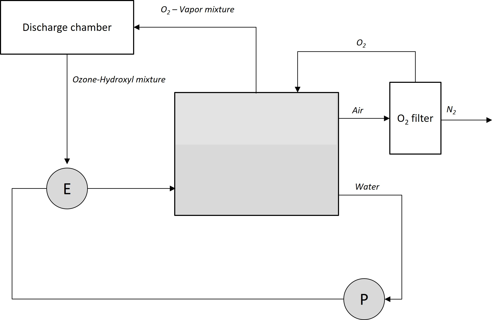

# Project Aetheris
Open source project for plasma water purification

# Water Purification Plasma Chemistry 101

Plasma water purification and activation is a well-known process based on the generation of Reactive Oxygen and Nitrogen Species (RONS) in a plasma discharge, which subsequently oxidize organic impurities and degrade pathogens in water.

## Key Reactions

The basic concept of plasma purification involves the generation of highly reactive species that oxidize organic pollutants and destroy pathogens. Oxidative purification is not a novel concept; it is a well-established technique in water treatment. For example, ozonation and chlorination are well-known oxidative processes used in the water purification industry. While ozone and chlorine are relatively stable, their oxidation potential is limited precisely because of their stability.

In gas discharges, short-lived radicals with excellent oxidation potential can be generated. These radicals are rarely found in nature due to their high reactivity, which results in very short lifespans—on the order of milliseconds or even less.

The hydroxyl radical (OH) has one of the highest oxidation potentials, second only to fluorine, but fortunately, it does not produce toxic by-products. The hydroxyl radical is the most significant species in plasma chemistry, actively oxidizing pollutants and destroying pathogens, and serving as a precursor to other powerful oxygen and nitrogen radicals.

In designing plasma-based water purification technology, we optimized the production of hydroxyl radicals to enhance the efficiency of pollutant oxidation and pathogen destruction.

The hydroxyl radical (OH) plays a critical role in this process. In the literature, the following reaction is often mentioned:

`e + H2O -> OH + H`

However, this reaction requires electron energies greater than **9 eV**, which are rare in atmospheric-pressure gas discharges in air. Additionally, this is a slow reaction. A more efficient way to generate OH is through the following reaction involving excited atomic oxygen:

`e + O2 -> O(1D) + O(3P)`

`H2O + O(1D) -> OH + OH`

`O2 + O(1D) -> O2 + O`

`N2 + O(1D) -> N2 + O`

The dissociation of O₂ is much faster than that of H₂O. After O(1D) is formed, it is a highly reactive species that most likely reacts with N₂, O₂, or H₂O. The balance between H₂O, O₂, and N₂ depends on their concentrations. In dry, cold air, about 90% of O(1D) is lost due to relaxation with N₂ and O₂, but in hot, humid air, around 20% of O(1D) is lost due to relaxation.

These reactions are well understood, but the importance of igniting plasma in warm, humid air is often not clearly emphasized in the literature.

## Ozone's Role in Plasma Chemistry

Another critical factor is the presence of ozone (O₃), as it prolongs the lifespan of OH through well-known atmospheric chemistry cycles involving ozone destruction:

`OH + O3 -> O2 + HO2`

`HO2 + O3 -> OH + 2O2`

While these reactions are not particularly fast, ozone is a relative stable molecule and can accumulate in the discharge chamber, reaching high concentrations. Furthermore, HO₂ is a reactive radical that easily dissolves in water, generating hydroxyl radicals in the liquid phase. It plays a significant role in Advanced Oxidation Processes (AOPs) in water.

One crucial aspect that needs attention is the accumulation of NO₂⁻ and NO₃⁻ ions in water treated with plasma. The cyclic synthesis and breakdown of peroxynitrite, with a residual tail of these ions, seems to be a plausible explanation for the phenomenon of Plasma Activated Water (PAW). A more detailed discussion of the synthesis of nitrogen compounds in plasma discharge in water can be found [here](https://onlinelibrary.wiley.com/doi/abs/10.1002/ppap.202000058)

While in some applications—such as sterilization and disinfection in medicine or accelerating plant growth—this fact is a significant advantage, for the production of high-quality drinking water, nitrogen compounds are unacceptable. Therefore, reducing nitrogen concentration is necessary not only to increase ozone levels but also to eliminate residual nitrates and nitrites from the water. However, if we use this technology and reactor for producing water for agriculture, the oxygen filter must be removed from the design.

**Too simple for you?** You can [read more](/discharge_model/glinding_arc_in_ejector_flow.pdf) in the discharge model documentation, where the concept is discussed in greater detail

## In Summary

An ozone-hydroxyl mixture in highly humid air is an excellent combination for mixing with contaminated water.

# Basic Design Principles

1. **Separation of Plasma and Water**  
   It is not necessary to treat contaminated water by directly applying plasma to its surface. This approach is inefficient and difficult to scale. Instead, we generate the ozone-hydroxyl mixture separately and mix it with the water.

2. **Discharge Chamber Design**  
   The most effective method is to feed the discharge chamber with humidified air, then mix the activated air-vapor mixture with the water. An ejector system seems to be the most efficient way to achieve this.

3. **Oxygen and Nitrogen Control**  
   Since ozone is required for higher efficiency, a circulation system during the treatment process is essential. Alternatively, nitrogen should be removed from the water tank at the beginning of the treatment process for better results.

# Overall Device Design

- **Power Electronics**: See the [power_electronics](./power_electronics/).
- **Discharge Chamber**: See the [discharge_chambers](./discharge_chambers/).
- **Ejector (E)**: For simple ejector models and mixing system dimensions, refer to the [ejector_model](./ejector_model/). Note: the ejector is often combined with the discharge chamber, but these models provide key inputs for the mixing system design.
- **O₂ Filter**: A standard O₂ concentrator with molecular sieves.
  
**Important** Please, read [issues](https://github.com/kinetikalab/project_aetheris/issues) before trying to repeat the design.

# Additional information
2-dimentional gas dicharge model (С parallel code) with plasma-fluid drift-diffusion approximation here [discharge_model](./discharge_model/)

Experimental results are [here](/results) - to be updaded soon (interesting results are coming soon)
